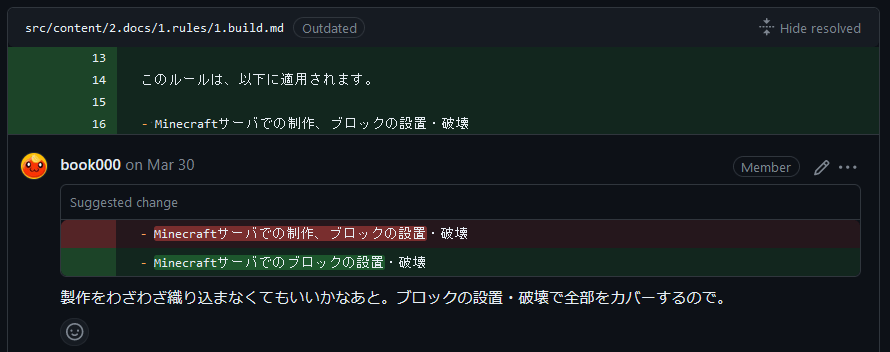

# プルリクエストの運用について

`jaoafa/jaoweb4` におけるプルリクエストの運用は以下のように行われています。  
すべての編集作業（ページ構成の変更、デザインの変更、コンテンツの追加・編集・削除）はフォークリポジトリからのプルリクエストによる **変更申請 → 承認 → 採用** のプロセスを踏みます。

!!! note "作業手順について"
    GitHub はかなりの頻度で見た目やボタンの挙動が変わるため、ここでは詳しい手順を記載しません。  
    あえて専門用語の後に括弧書きで似た一般用語（または和訳）を併記しています。  
    `GitHub フォーク やり方` や `GitHub プルリクエスト 出し方`、`Git ブランチ とは` などの検索ワードを用いて Google などで検索し複数のページを閲覧するか、やり方を Discord で聞いてください。

## 全体の流れ

```mermaid
flowchart TD
  start(("開始"))
  fork["フォーク（コピー）"]
  clone["クローン（ダウンロード）"]
  fetch["フェッチ（記録の更新）"]
  branch["ブランチを作成"]
  editing(["ファイルの追加・編集・削除"])
  commit["コミット（記録）"]
  push["プッシュ（アップロード）"]
  pull-request["プルリクエスト（申請）"]
  review["レビュー（審査）"]
  approve(["Approve（承認）"])
  style approve fill:green
  request-changes(["Request changes（修正リクエスト）"])
  style request-changes fill:darkred
  fix(["ファイルの修正、サジェストの受け入れ"])
  merge["マージ（取り込み・受け入れ）"]
  finished(("完了"))

  start-->fork
  start-->fetch

  fork-->clone
  clone-->branch

  subgraph 作業ごとに実施
    fetch-->branch
    branch-->editing
    editing-->commit
    commit-->editing
    commit-.->push

    push-->pull-request
    pull-request-->review
    push-. 既にプルリクエストがある場合 .->review
    review-->approve
    review-->request-changes
    request-changes-->fix
    fix-->commit

    approve-->merge
  end

  merge-->finished
```

## プルリクエスト

`jaoafa/jaoweb4` のプルリクエストでは、ラベルを用いた追加機能を提供しています。  
運営メンバーが以下ラベルをつけることで、対応する処理が実行されます。

### `🚀request-deploy`

このラベルをつけることで、Cloudflare Pages というサービスを用いて、プルリクエストの変更内容を含む「プレビューサイト」を作成（デプロイ）、URL を投稿・更新します。  
サイトがデプロイされると、以下のように投稿されます。すでにデプロイしたことがある場合は既存のメッセージが更新されます。

メッセージ中の `Deploy Preview Url` 行にある URL をクリックすることで、プレビューを閲覧できます。

### `🔧fix-textlint`

複数人で編集されることを想定しているため、「リンクの前後にスペースを入れるのか」というように、編集者によって「差」が発生します。  
これらの「差」を極力減らすため、文章校正ツール [textlint](https://github.com/textlint/textlint) を導入しています。

このラベルをつけることで、textlint による文章の体裁修正が行われます。

## レビュー

レビューとは、変更が採用される前に「変更内容が問題ないか」を確認するチェック作業のことです。  
レビューでは「Approve（承認）」と「Request changes（修正リクエスト）」があり、特定のユーザによる承認を受けなければマージ（変更内容の受け入れ）を行うことはできません。

レビューは [CODEOWNERS](https://github.com/jaoafa/jaoweb4/blob/main/.github/CODEOWNERS) というファイルに沿って行われます。変更されたファイルに応じて、以下すべてのユーザ（コードオーナー）による承認が必要です。

- すべてのファイル: [Hiratake](https://github.com/Hiratake)
- `src/content/` フォルダ以下のファイル: [book000](https://github.com/book000)
- `docs/` 以下のファイル: [book000](https://github.com/book000)

なお、コードオーナーでないユーザであっても、プルリクエストがマージまたはクローズされるまでは、誰でもレビューを行うことができます。

### Suggested change について

Request changes のレビューでは、以下のような Suggested change（具体的な修正の提案）が含まれていることがあります。  
抽象的なレビューではレビューを受ける側もわかりにくいため、Suggested change による具体的なレビューを推奨しています。

これらは、`Commit Suggestion` ボタンをクリックすることで提案をそのまま受け入れることができます。もちろん、提案内容に異議があればコメントすることでより良い案を再考することもできます。

### コミット後の再レビューについて

ブランチルールという設定により、レビューを受けた後に新しいコミットを追加した場合、既存のレビューが取り消されるようになっています。  
この場合、**再度コードオーナーからのレビューが必要** です。

### 承認後のマージについて

コードオーナー全員からの承認レビューを受けたプルリクエストは、原則として **最後のレビュアーが行ってください**。  
最後のレビュアーがマージを忘れている場合は、気づいた他のユーザーがマージしてください。

### レビュー時の `Resolve` について

Request changes を受け、修正を行った後、そのレビューが「完了」したことを示す `Resolve conversation` という機能（ボタン）があります。  
このボタンは、原則として **レビューを行った側（レビュアー）がクリック** してください。

```mermaid
sequenceDiagram
  Note over 編集者: プルリクエストを作成
  レビュアー->>編集者: レビュー（Request changes）を行う
  Note over 編集者, レビュアー: 必要に応じて GitHub コメント上で話し合い
  Note over 編集者: 修正コミット
  編集者->>レビュアー: 修正したことをコメントで伝える
  Note over レビュアー: 修正内容の確認
  レビュアー-->>編集者: Resolve conversation ボタンを押す
  
```

## 利用するマージ戦略について

原則として、プルリクエストのコミットすべてが 1 つのコミットにまとめられてマージされる `Squash and merge` を利用します。
